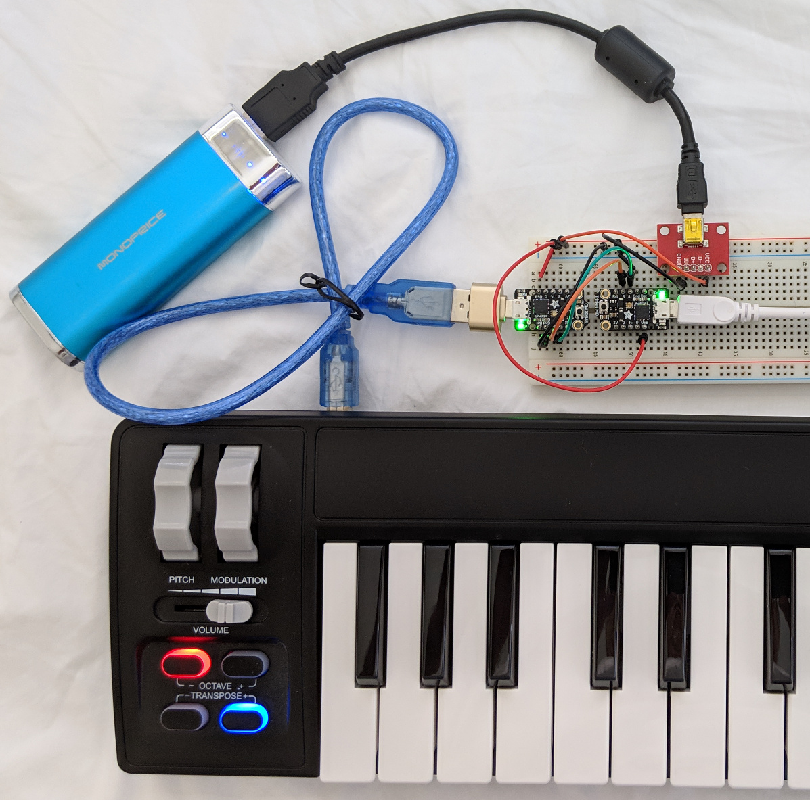

# USB Host MIDI to USB Host MIDI

usbhostmidix2 is two USB host MIDI ports connected MIDI IN to MIDI OUT and vice
versa. Connect two USB MIDI devices to each other without a computer. For
example, connect a USB MIDI controller to a USB MIDI guitar amp/effects box. Or
connect a USB MIDI keyboard to a synth.

For more than two USB MIDI devices, see the Raspberry Pi version of a USB host
MIDI hub. [https://github.com/gdsports/rpi-usb-host-midi-hub](https://github.com/gdsports/rpi-usb-host-midi-hub)

## Hardware

* 2 x Adafruit Trinket M0 boards
* 2 x USB OTG to host cable or adapters
* 1 x 5V, 1A power supply

Optional

The following makes to easy to access the 5V and grounds pins on a wall adapter
power supply with a micro USB connector.

* 1 x [Micro USB breakout board](https://www.adafruit.com/product/1833)

Power	|Trinket M0	|Trinket M0
--------|-----------|----------
GND		|GND		|GND
5V		|USB		|USB
n/a		|TX/4		|RX/3
n/a		|RX/3		|TX/4

## Firmware

[USB Host Co-Processor](https://github.com/gdsports/usbhostcopro)

[USB Host MIDI firmware](https://github.com/gdsports/usbhostcopro/blob/master/firmware/MIDIUARTUSBH.ino.trinket_m0.uf2)

The USB host MIDI firmware can be burned into the Trinket M0 just by dragging
and dropping the UF2 file on to the Trinket M0 USB drive. There is no need to
install the Arduino IDE, source code, or USB serial device driver.

* Download the UF2 file.
* Plug in the Trinket M0 to a computer.
* Double tap the Trinket M0 reset button.
* When the TRINKETBOOT USB drive appears, drop the UF2 file on to the drive.
* Wait until the Trinket M0 reboots.

At this point, the Trinket M0 is now in USB host mode so it no longer talks
with the computer. Load the firmware on both Trinket M0s. Connect the power
and UART TX and RX as shown in the previous section.

